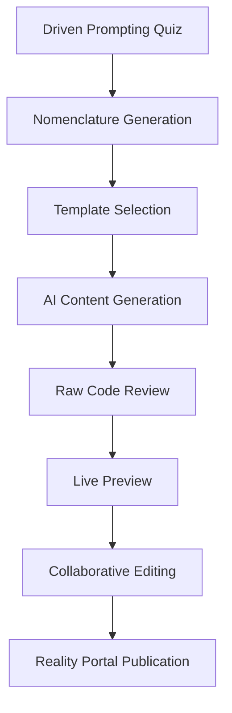

# Processing Prompt UI - AQUA V. Template Generator

## Overview

Processing Prompt UI is an advanced AI-powered template generation interface that transforms AQUA V. nomenclature codes into comprehensive, multi-format documentation with real-time collaboration and reality-aware compilation.


## 🚀 Key Features

### 🧠 Driven Prompting Quiz System
- **Interactive Guided Questionnaire**: Step-by-step nomenclature building with real-time validation
- **AQUA V. Standards Compliance**: Automatic validation against v12.3 nomenclature structure
- **Educational Context**: Learn proper nomenclature construction through guided interaction
- **Error Prevention**: Eliminate common mistakes with contextual validation

### 🤖 AI-Powered Template Generation
- **LLM Integration**: Advanced prompt engineering with context-aware generation
- **Multi-Format Output**: Generate Markdown, HTML5, and Word documents
- **Nomenclature Parsing**: Intelligent parsing of AQUA V. codes for enhanced context
- **Custom Prompting**: Add specific requirements and technical context

### 👥 Real-time Collaborative Editing
- **Live Cursors**: See collaborators' positions and selections in real-time
- **Comments System**: Contextual comments with threading and resolution
- **Change Tracking**: Monitor edits and activity feed
- **Conflict Resolution**: Seamless collaborative editing without conflicts

### 🌐 Reality Portal Management
- **Reality Classification**: Organize repositories by rendering context (PHYSL, VRTUL, AUGMT, etc.)
- **Portal Dashboard**: Visual overview of reality-specific document repositories
- **Context-Aware Browsing**: Browse documents within their appropriate reality context
- **Cross-Reality Discovery**: Find related documents across different reality portals

## 🏗️ Architecture

### Reality Contexts Supported

| Reality | Code | Description | Portal Features |
|---------|------|-------------|-----------------|
| **Physical** | PHYSL | Traditional documentation for physical systems | PDF rendering, manufacturing specs |
| **Virtual** | VRTUL | Immersive 3D documentation and training | 3D preview, VR compatibility |
| **Augmented** | AUGMT | Enhanced real-world documentation | AR overlays, spatial anchors |
| **Mixed** | MIXRL | Hybrid physical-digital experiences | Multi-modal interaction |
| **Simulation** | SIMUL | Virtual testing and scenario documentation | Test data, physics models |
| **Extended** | EXTND | Advanced immersive technologies | XR compatibility, research docs |
| **Hybrid** | HYBRD | Multi-modal reality experiences | Cross-platform support |
| **Operational** | OPERT | Live system documentation | Real-time updates, operational data |

### Document Lifecycle



## 🎯 Getting Started

### Prerequisites
- Node.js 18+ 
- Modern web browser with WebGL support
- Access to AQUA V. systems (for full functionality)

### Installation

1. **Clone the repository**
   ```bash
   git clone https://github.com/aqua-v/processing-prompt-ui.git
   cd processing-prompt-ui
   ```

2. **Install dependencies**
   ```bash
   npm install
   ```

3. **Start development server**
   ```bash
   npm run dev
   ```

4. **Open in browser**
   Navigate to `http://localhost:5173`

### Quick Start Guide

1. **Start with Driven Prompting**
   - Click "Guided Quiz" in the header or navigate to the Driven Prompting tab
   - Follow the interactive questionnaire to build a valid AQUA V. nomenclature
   - The system will guide you through each field with validation and help text

2. **Generate Templates**
   - Browse the Template Library for pre-built templates
   - Use your generated nomenclature code for enhanced context
   - Configure output format (Markdown, HTML, Word)
   - Select appropriate Reality Portal for publication

3. **Collaborative Editing**
   - Start a collaborative session from Generated Documents
   - Invite team members to edit in real-time
   - Use comments for feedback and discussion
   - Track changes in the activity feed

4. **Reality Portal Management**
   - Configure repositories by reality context
   - Browse documents within appropriate portals
   - Manage cross-reality document relationships

## 📚 Documentation Structure

### AQUA V. Nomenclature Format
```
[LINE]-[PRODUCT]-[VARIANT]-[NUMBER]-[PHASE]-[CRITICALITY]-[DOCUMENT]-[APPLICATION]-[METHOD]-[REALITY]-[UTCS]-[REGULATORY]-[VERSION]
```

**Example:**
```
AMPEL3-BWB-Q100-0001-MNT-SE-AMM-TSG-TR-VF-E001-0001-AUGMT-07150000000-MUL-v2.0.0
```

### Template Categories by Phase

| Phase | Code | Templates Available | Criticality Levels |
|-------|------|--------------------|--------------------|
| Strategy & Planning | STR | Business Plans, Market Analysis | Critical, Essential |
| Conceptual & Feasibility | CON | Requirements, Feasibility Studies | Critical, Essential |
| Design & Engineering | DES | SRS, HDD, System Specs | Critical, Essential, Important |
| Development & Prototyping | DEV | Implementation Plans, Build Specs | Critical, Essential |
| Testing & Validation | TST | Test Plans, Reports, Analysis | Critical, Essential |
| Production & Manufacturing | PRD | Manufacturing Specs, Quality Plans | Critical, Essential |
| Operations & Service | OPS | Manuals, Procedures, Policies | Critical, Essential, Important |
| Maintenance & Support | MNT | Maintenance Manuals, Service Bulletins | Critical, Essential |

## 🔧 Configuration

### Environment Variables

```env
# AI Integration
VITE_LLM_ENDPOINT=https://api.aqua-v.com/llm
VITE_LLM_MODEL=gpt-4o

# Repository Configuration
VITE_DEFAULT_REPOSITORY_PATH=/local/aqua-v/docs
VITE_NETWORK_REPOSITORY_BASE=smb://aqua-v-net

# Reality Portal Settings
VITE_PHYSL_PORTAL_URL=/portal/physical
VITE_VRTUL_PORTAL_URL=/portal/virtual
VITE_AUGMT_PORTAL_URL=/portal/augmented
```

### Repository Structure

```
AQUA_V/
├── real_physl/         # Physical Reality Portal
│   ├── templates/
│   ├── generated/
│   └── archive/
├── real_vrtul/         # Virtual Reality Portal
│   ├── 3d_models/
│   ├── vr_scenes/
│   └── immersive_docs/
├── real_augmt/         # Augmented Reality Portal
│   ├── ar_overlays/
│   ├── spatial_anchors/
│   └── field_manuals/
└── [other reality contexts...]
```

## 🧪 Development

### Tech Stack
- **Frontend**: React 18, TypeScript, Tailwind CSS
- **UI Components**: shadcn/ui v4
- **Animations**: Framer Motion
- **State Management**: React Hooks, Local Storage
- **AI Integration**: Custom LLM API integration
- **Build Tool**: Vite

### Project Structure

```
src/
├── components/          # Reusable UI components
│   └── ui/             # shadcn/ui components
├── hooks/              # Custom React hooks
├── lib/                # Utility functions
├── styles/             # Global styles
├── App.tsx             # Main application component
└── main.tsx           # Application entry point
```

### Contributing

1. **Fork the repository**
2. **Create a feature branch** (`git checkout -b feature/amazing-feature`)
3. **Commit changes** (`git commit -m 'Add amazing feature'`)
4. **Push to branch** (`git push origin feature/amazing-feature`)
5. **Open a Pull Request**

### Code Standards
- **TypeScript**: Strict mode enabled
- **ESLint**: Extended configuration with React hooks
- **Prettier**: Code formatting
- **Conventional Commits**: Commit message format

## 🔒 Security & Compliance

### Data Security
- **Local Storage**: Sensitive data stored locally by default
- **Encryption**: Optional encryption for classified documents
- **Access Control**: Role-based repository access
- **Audit Trail**: Complete activity logging

### AQUA V. Compliance
- **Nomenclature Standards**: v12.3 compliance validation
- **Document Templates**: Certified template library
- **Reality Classification**: Proper context classification
- **Version Control**: Full document lifecycle tracking

## 📊 Performance

### Optimization Features
- **Lazy Loading**: Components and templates loaded on demand
- **Virtual Scrolling**: Efficient large list rendering
- **Code Splitting**: Automatic bundle optimization
- **Caching**: Intelligent template and document caching

### Browser Requirements
- **Modern Browsers**: Chrome 90+, Firefox 88+, Safari 14+
- **WebGL**: Required for 3D previews
- **Local Storage**: 10MB+ recommended
- **Network**: High-speed recommended for collaboration

## 🆘 Support

### Getting Help
- **Documentation**: Comprehensive guides in `/docs`
- **Examples**: Sample templates and configurations
- **Community**: Join the AQUA V. developer community
- **Support**: Contact support@aqua-v.com

### Troubleshooting

| Issue | Solution |
|-------|----------|
| Quiz not loading | Check browser JavaScript settings |
| AI generation fails | Verify LLM endpoint configuration |
| Collaboration issues | Check network connectivity |
| Repository sync problems | Verify repository permissions |

## 📝 License

This project is licensed under the AQUA V. Enterprise License - see the [LICENSE](LICENSE) file for details.

## 🙏 Acknowledgments

- **AQUA V. Team**: Core development and design
- **AI Research Division**: LLM integration and optimization
- **Reality Labs**: Multi-context rendering development
- **Community Contributors**: Testing and feedback

---

**Version:** 1.0.0  
**Last Updated:** 2024-01-15  
**Compatibility:** AQUA V. v12.3+

For the latest updates and documentation, visit: [https://docs.aqua-v.com/processing-prompt-ui](https://docs.aqua-v.com/processing-prompt-ui)